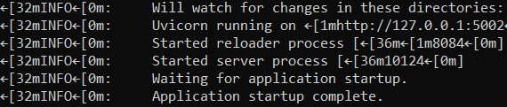
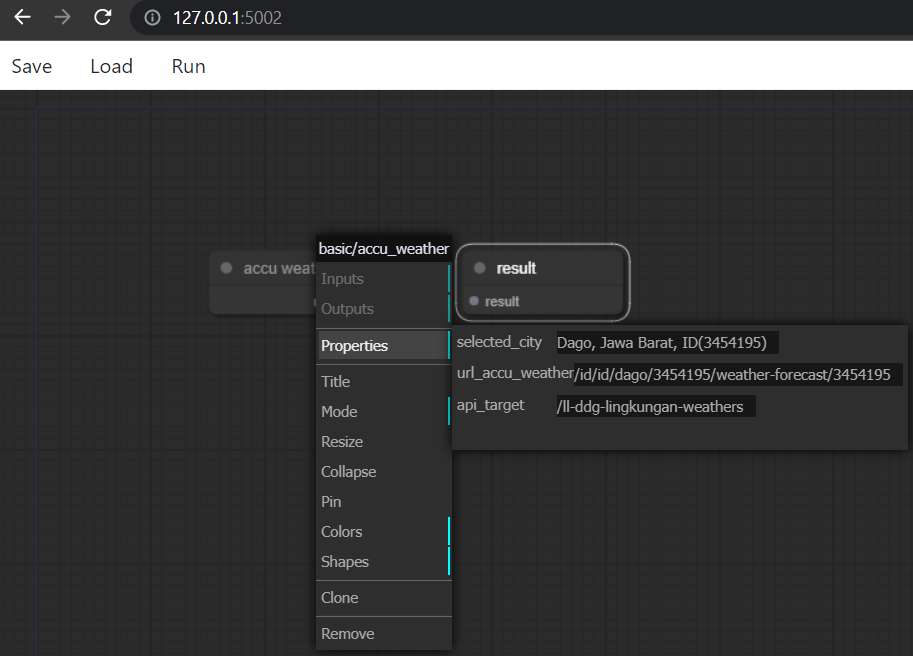

# Robotic Process Automation Codebase
Codebase ini merupakan framework dasar untuk kebutuhan Robotic Process Automation

## Instalasi

RPA Codebase membutuhkan [Python](https://www.python.org/downloads/).

Install dependencies dan start server.
```sh
cd rpa-codebase
pip install -r requirements.txt
python app.py
```

Silakan akses menggunakan browser 
```sh
127.0.0.1:5002
```




## Referensi
https://github.com/jagenjo/litegraph.js
https://fastapi.tiangolo.com/